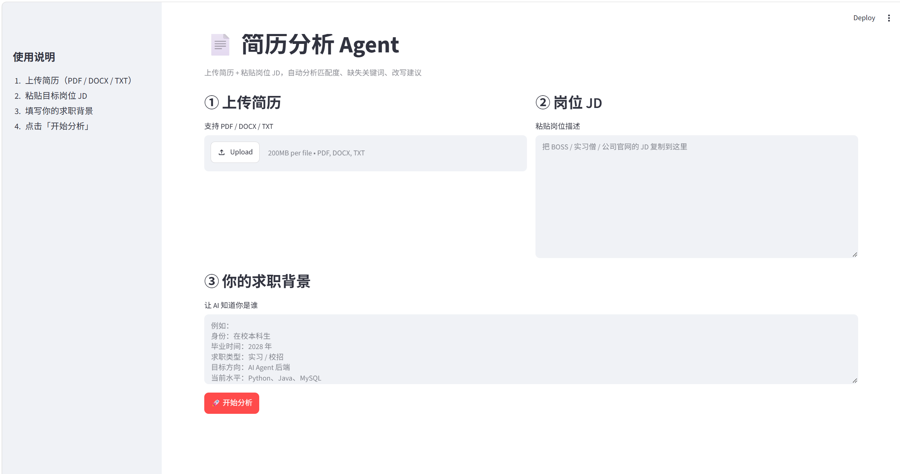

# 📄 简历分析 Agent

基于 DeepSeek 大模型的智能简历分析 Agent。上传简历 + 粘贴岗位 JD，自动分析匹配度，生成改写建议、定制摘要和求职信。

## ✨ 功能

- 📄 支持 PDF / DOCX / TXT 三种简历格式
- 🎯 岗位级别识别：自动判断 JD 属于实习 / 校招 / 中级 / 资深
- 📊 匹配分数：0-100 分，区分硬性缺失、加分项、正在学习
- ✍️ 智能改写建议：针对目标岗位给出具体可执行的修改方案
- 📝 自动生成定制摘要和求职信
- ⬇️ 一键下载 Markdown 报告
- 🖥️ Streamlit 网页界面，无需命令行

## 🛠️ 技术栈

- Python 3.13
- DeepSeek API（兼容 OpenAI SDK）
- Streamlit（网页界面）
- pypdf / python-docx（文件解析）
- rich（终端美化）

## 🚀 快速开始

### 1. 克隆项目

git clone https://github.com/solitude5698/resume-agent.git
cd resume-agent

### 2. 安装依赖

uv sync

### 3. 配置 API Key

在项目根目录新建 `.env` 文件：

DEEPSEEK_API_KEY=你的Key

### 4. 运行网页版

uv run streamlit run app.py

浏览器打开 http://localhost:8501

### 5. 运行命令行版

uv run python run.py

## 📸 界面预览

## 📁 项目结构

resume-agent/
├── src/
│   └── resume_agent/
│       ├── agent.py        # 核心逻辑
│       ├── prompts.py      # 提示词
│       └── file_loader.py  # 文件读取
├── data/                   # 简历 / JD / 背景
├── output/                 # 生成的报告
├── app.py                  # Streamlit 网页
├── run.py                  # 命令行入口
├── pyproject.toml
└── README.md

## 🧠 设计思路

1. **分档评估**：不是只按 JD 最高要求打分，而是结合求职者身份判断是否错配。
2. **三档关键词**：硬性缺失、加分项缺失、正在学习，帮助区分优先级。
3. **输出结构化**：强制 AI 返回 JSON，程序解析后渲染，结果稳定。
4. **容错处理**：模型输出可能带多余文字，使用 `extract_json` 兼容处理。

## 🔮 后续计划

- [ ] 支持多岗位对比
- [ ] 支持模拟面试
- [ ] 支持导出 Word / PDF
- [ ] 部署到 Streamlit Cloud

## 📄 License

MIT